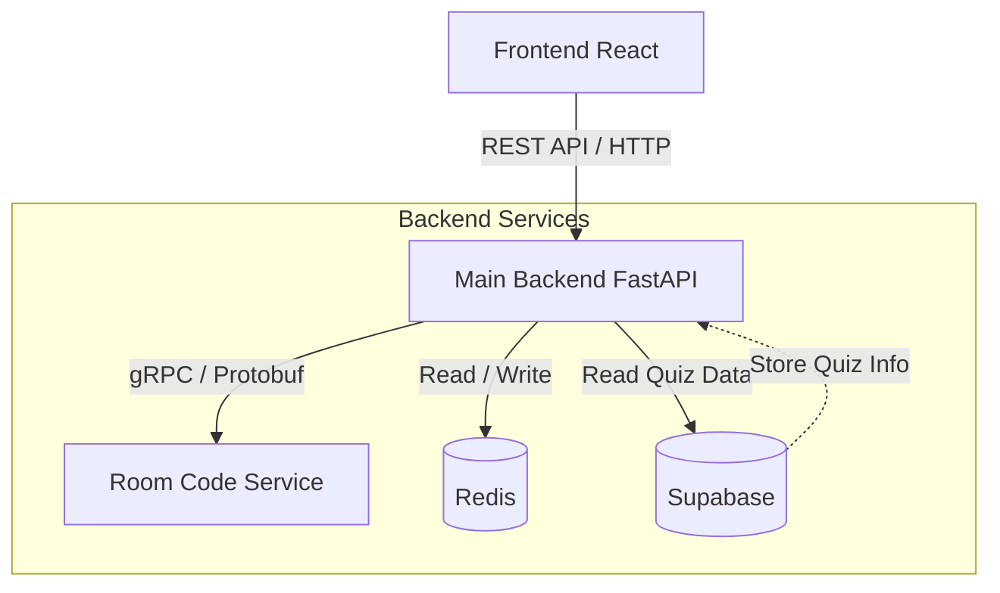

# QuizzyLive - Real-Time Quiz Platform

## 📑 Table of Contents

- [About the Project](#-about-the-project)
- [Tech Stack](#️-tech-stack)
- [How to Use](#-how-to-use)
  - [Main Menu](#1-main-menu-start-screen-)
  - [Dashboard & Quiz Creation](#2-dashboard--quiz-creation-host-mode-)
  - [Host Lobby](#3-host-lobby-waiting-room-)
  - [Player Join Screen](#4-player-join-screen-)
  - [Player Waiting Room](#5-player-waiting-room-lobby-)
  - [Active Game Interface](#6-active-game-interface-question-view-)
  - [Game Over Screen](#7-game-over-screen-results-)
- [Project setup](#-setup)
- [Project Installation & Running](#project-installation--running)
- [Architecture & Tech Stack](#architecture--tech-stack)
- [DB Creation (Supabase)](#db-creation-supabase)

---

## 🌟 About the Project

**QuizzyLive** is a dynamic, real-time quiz platform designed to bring people together through competitive fun. Inspired by interactive tools like Kahoot, it allows users to create custom quizzes, host live sessions, and compete for the top spot on the leaderboard instantly.

Whether for education, team building, or a party game, QuizzyLive offers a seamless multiplayer experience. A **Host** manages the game flow and questions, while **Players** join via a simple code to answer in real-time.

### 🎯 Key Features
* **⚡ Real-Time Multiplayer:** Synchronized gameplay where the Host controls the pace and players answer simultaneously.
* **🛠️ Custom Quiz Builder:** Intuitive interface for creating, editing, and archiving your own unique quizzes.
* **🚀 Instant Access:** Players can jump straight into the action using a 5-character session code-no complex setup required.
* **🏆 Live Leaderboard:** Dynamic scoring system that updates after every round to keep the competition fierce.

## 🛠️ Tech Stack

This project leverages a modern, high-performance architecture to ensure seamless real-time interaction and scalability.

### 🎨 Frontend
* **React**: Builds the dynamic user interface for both Host and Player roles.
* **WebSocket Client**: Custom implementation for handling real-time game events.

### ⚙️ Backend
* **FastAPI (Python)**: The core web framework handling HTTP requests and WebSocket connections.
* **Redis**: Used as a high-speed cache and temporary storage for active game sessions to ensure low latency.
* **Supabase**: Acts as the primary database provider.

### 📡 Communication Protocols
The system utilizes a hybrid approach for optimal performance:
* **REST API**: Handles standard CRUD operations (creating, updating, deleting quizzes).
* **WebSockets (RTC)**: Enables full-duplex communication for live gameplay (joining rooms, answering questions, leaderboard updates).
* **gRPC**: A dedicated microservice responsible for generating unique room codes without collisions.
* **GraphQL**: Integrated via **Strawberry** to efficiently fetch detailed quiz metadata for info modals.

---

## 📖 How to Use

This section guides you through the QuizzyLive interface, explaining the workflow for both Hosts and Players.

### 1. Main Menu (Start Screen) 🏠


The entry point for all users. Here you determine your role in the upcoming game session.

#### 🖥️ UI Elements
* **`Create quiz (Створити вікторину)`**: Select this button to become the **Host** (create or manage quizzes).
* **`Join game (Приєднатись до гри)`**: Select this button to become a **Player** (join an existing lobby).

#### 💡 Usage
Simply click on the desired action. If you want to manage quizzes or run a game, choose **Create quiz**. If you have a code from a host and want to participate, choose **Join game**.

---

### 2. Dashboard & Quiz Creation (Host Mode) 📝


The command center for Hosts. This screen is split into two sections: creating new content and managing the archive.

#### 🖥️ UI Elements
* **`Creation (Створення)`**: The header for the new quiz form.
* **`Quiz name (Назва вікторини)`**: Input field for the title of your quiz.
* **`Quiz description (Опис вікторини)`**: Input field for a short description.
* **`Question 1 (Питання 1)`**: The section to input question text and answers.
* **`Correct (Правильна)`**: Radio button to mark which answer is the right one.
* **`Archive (Архів)`**: The sidebar list containing all saved quizzes.
* **`Delete (Видалити)`**: Button to remove a specific question or quiz.

#### 💡 Usage
To build a new game, fill in the **Quiz name** and add your questions in the form. Be sure to mark the correct answer for each question using the **Correct** radio button.

Alternatively, browse the **Archive** on the right side. Each item in the archive has quick-action buttons:
* 🎮 **Play**: To load the quiz into the lobby.
* ℹ️ **Edit**: To modify the quiz content.
* ⛔ **Delete**: To remove the quiz permanently.

---

### 3. Host Lobby (Waiting Room) ⏯

️
Once a Host selects a quiz to play, this screen appears. It generates the necessary connection details for players to join.

#### 🖥️ UI Elements
* **`Connection code (Код для підключення)`**: Displays the unique game ID (e.g., `XC5A1`).
* **`Copy code (Скопіювати код)`**: Button to copy the ID to your clipboard.
* **`Participants (Учасники)`**: Shows the count and list of joined players (e.g., `Participants (0)`).
* **`Start quiz (Почати вікторину)`**: Button to lock the lobby and launch the game session.

#### 💡 Usage
Share the **Connection code** with your players verbally or via chat. As they join, their names will appear in the **Participants** list. Once everyone is ready, click **Start quiz** to begin the first round.

---

### 4. Player Join Screen 🤝


The portal for players to enter a game session using a code.

#### 🖥️ UI Elements
* **`Join quiz (Приєднатись до вікторини)`**: Screen header.
* **`Quiz code (Код вікторини)`**: Input field for the unique game ID (e.g., `AS12DV`).
* **`Your name (Ваше ім'я)`**: Input field for the player's nickname.
* **`Join (Приєднатись)`**: Button to confirm and enter the lobby.

#### 💡 Usage
Enter the code provided by the Host into the **Quiz code** field. Pick a unique nickname for the **Your name** field and click **Join**. You will be redirected to the waiting area.

---

### 5. Player Waiting Room (Lobby) ⏳


A holding screen for players who have successfully joined but are waiting for the Host to start the game.

#### 🖥️ UI Elements
* **`Waiting for quiz start... (Очікуємо початку вікторини...)`**: Status message indicating the game hasn't started yet.
* **`The host will start the game soon (Ведучий почне гру незабаром)`**: Sub-status message.
* **`Connected (Підключено)`**: Indicator top-right showing that the server connection is active.

#### 💡 Usage
No action is required here. Just wait for the Host to trigger the start of the game. The screen will automatically update to show the first question when the game begins.

---

### 6. Active Game Interface (Question View) ❓


The main gameplay screen. The interface differs slightly between the Host and the Player.

#### 🖥️ Common UI Elements
* **`Question X / Y (Питання 1 / 3)`**: Displays current progress.
* **`Leaderboard (Таблиця лідерів)`**: Live ranking of players with their scores.
* **Timer**: A countdown (e.g., **`22s`**) for the current question.

#### 🛠️ Host-Specific Controls
* **`Show answer (Показати відповідь)`**: Reveal the correct option to everyone before the timer ends.
* **`Finish (Завершити)`**: End the quiz immediately.

#### 🎮 Player Controls
* **Answer Options**: Interactive buttons (1, 2, 3...) to select an answer.

#### 💡 Usage
**For Hosts:** Monitor the timer. You can click **Show answer** to speed up the game if everyone has answered, or wait for the time to run out.

**For Players:** Read the question and click on the answer you think is correct before the timer reaches zero. Watch the **Leaderboard** to track your score in real-time.

---

### 7. Game Over Screen (Results) 🏆


The final screen displaying the outcome of the quiz session.

#### 🖥️ UI Elements
* **`Quiz finished (Вікторина завершена)`**: Header indicating the session is over.
* **`Final leaderboard (Підсумкова таблиця лідерів)`**: The definitive list of scores and rankings.
* **`Return to main (Повернутися на головну)`**: Button to exit the session.

#### 💡 Usage
Review the **Final leaderboard** to announce the winner. When finished, click **Return to main** to go back to the start screen. From there, you can begin a new session or create a new quiz.

---


## 🚀 Setup

Before running the project, you need to configure the environment variables for both the backend and frontend to ensure proper connection to the database and services.

### 1. Environment Configuration

#### 🔧 Backend Setup
Create a `.env` file in the `backend/` directory (or the root folder of your server application) and populate it with your credentials:

```env
# Environment Name (dev / staging / production)
APP_ENV=backend

# Port for FastAPI backend
BACKEND_PORT=8000

# =========================
# 🌐 SUPABASE CONNECTION
# =========================

# Supabase Project URL
SUPABASE_URL=""

# Supabase Anonymous Key
SUPABASE_ANON_KEY=""

# Supabase Service Role Key
SUPABASE_SERVICE_ROLE_KEY=""

# Database Schema Name
SUPABASE_SCHEMA=public

# Redis Connection URL
REDIS_URL=redis://localhost:6379
```

#### 🎨 Frontend Setup
Create a `.env` file in the `frontend/` directory and define the API endpoints:

```env
# Base URL for the REST API
VITE_API_BASE_URL=

# Base URL for WebSocket connections
VITE_WS_BASE_URL=

# URL for GraphQL queries
VITE_GRAPHQL_URL=
```

---

## Project Installation & Running

> You must run **Backend**, **gRPC Service**, and **Frontend** in separate terminal windows.

---

### 🐍 Backend (FastAPI)

1. Navigate to the `backend` directory:

```bash
cd backend
```

2. Create and activate a virtual environment (recommended):

```bash
# Windows
python -m venv venv
.\venv\Scripts\activate

# macOS / Linux
python3 -m venv venv
source venv/bin/activate
```

3. Install Python dependencies:

```bash
pip install -r requirements.txt
```

4. Start the main API server:

```bash
uvicorn app.main:app --reload --port 8000
```

5. Start the gRPC service (in a separate terminal; required for room code generation):

```bash
# Make sure you are inside the backend folder and the virtual environment is activated
python room-code-service/server.py
```

> **Note:** Ensure your Redis server is running locally or via Docker before starting the backend.

---

### ⚛️ Frontend (React)

1. Navigate to the `frontend` directory:

```bash
cd frontend
```

2. Install Node.js dependencies:

```bash
npm install
```

3. Start the development server:

```bash
npm run dev
```

After launching the frontend, the application will be available at `http://localhost:4566` (or whichever port your terminal indicates).

---

### ✅ Pre-Launch Checklist

*  `.env` file is configured and placed in the project root.
*  Redis is running (locally or via Docker).
*  Backend virtual environment is activated before running services.
*  gRPC service is running in a separate terminal.
*  Frontend is running and accessible at the shown port.

---

* To stop uvicorn, press `Ctrl+C` in the terminal where it is running.

---
## DB Creation (Supabase)

This section describes the database schema setup for the quiz application using Supabase PostgreSQL.

### Schema Overview

The database consists of three main tables:
- **quizzes** - stores quiz metadata
- **questions** - stores questions with 4 answers each
- **quiz_sessions** - stores game session history and results

### SQL Setup

Run the following SQL in your Supabase SQL Editor to create all necessary tables, indexes, and triggers:

```sql
-- Create quizzes table
create table if not exists public.quizzes (
  id uuid primary key default gen_random_uuid(),
  title text not null,
  created_at timestamptz not null default now(),
  updated_at timestamptz not null default now()
);

-- Trigger for auto-updating updated_at field
create or replace function public.set_updated_at()
returns trigger as $$
begin
  new.updated_at = now();
  return new;
end;
$$ language plpgsql;

drop trigger if exists set_quizzes_updated_at on public.quizzes;
create trigger set_quizzes_updated_at
before update on public.quizzes
for each row execute function public.set_updated_at();

-- Questions table (4 answers + correct answer index)
create table if not exists public.questions (
  id uuid primary key default gen_random_uuid(),
  quiz_id uuid not null references public.quizzes(id) on delete cascade,
  question_text text not null,
  answers jsonb not null check (
    jsonb_typeof(answers) = 'array' and jsonb_array_length(answers) = 4
  ),
  correct_answer smallint not null check (correct_answer between 0 and 3),
  position int not null default 0
);

create index if not exists idx_questions_quiz on public.questions(quiz_id);
create index if not exists idx_questions_position on public.questions(position);

-- Enable Row Level Security (configure policies for production)
alter table public.quizzes enable row level security;
alter table public.questions enable row level security;

-- Note: Service role key bypasses RLS. Add policies for anonymous/authenticated access as needed.

-- Quiz sessions table for storing game state and results (added 05.11.2025)
create table public.quiz_sessions (
  id uuid primary key,
  quiz_id uuid references public.quizzes(id) on delete set null,
  room_code text not null,
  created_at timestamptz not null,
  ended_at timestamptz not null,
  questions jsonb not null,
  scoreboard jsonb not null
);

create index quiz_sessions_quiz_id_idx on public.quiz_sessions (quiz_id);
create index quiz_sessions_created_at_idx on public.quiz_sessions (created_at);
```

### Key Features

- **Automatic timestamps**: The `updated_at` field updates automatically on record changes
- **Data validation**: Questions must have exactly 4 answers, correct answer index must be 0-3
- **Cascading deletes**: Deleting a quiz removes all associated questions
- **Optimized queries**: Indexes on foreign keys and frequently queried fields
- **Session history**: Complete game sessions stored with questions and scoreboards


---

## Architecture & Tech Stack

The project follows a **microservice-oriented architecture**, separating the User Interface, the Core API, and specialized internal services.

### 🏗 High-Level Diagram



### 🧩 Components Breakdown

**1. Frontend (Client Layer)**
- **Tech:** React.js, Vite
- **Role:** Handles user interactions and renders the UI
- **Communication:** Sends HTTP requests (JSON) to the Main API Gateway

**2. Main Backend (API Gateway)**
- **Tech:** Python, FastAPI, Uvicorn
- **Role:** Central entry point handling:
  - Client HTTP requests
  - Business logic validation
  - Orchestration between Supabase, Redis and Microservices
- **Communication:** Talks to the Frontend via REST, to Supabase for quiz data, to Redis for session storage, and to the Room Service via gRPC

**3. Room Code Service (Microservice)**
- **Tech:** Python, gRPC
- **Role:** Dedicated service for generating unique room codes
- **Why gRPC?** High-performance, low-latency internal communication

**4. Data Layer**
- **Supabase:** Persistent storage for quiz data, questions, and game configurations
- **Redis:** Temporary session/room data and caching (fast in-memory)

### 🔄 Data Flow Example (Creating a Room)

1. **User** clicks "Create Room" on the **Frontend**
2. **Frontend** sends `POST /create-room` with quiz ID to **FastAPI**
3. **FastAPI** fetches quiz data from **Supabase** (questions, settings, etc.)
4. **FastAPI** makes a **gRPC call** to the **Room Code Service** requesting a unique room ID
5. **Room Code Service** generates the ID and returns it
6. **FastAPI** stores the session with quiz data in **Redis** and responds back to the **Frontend**
